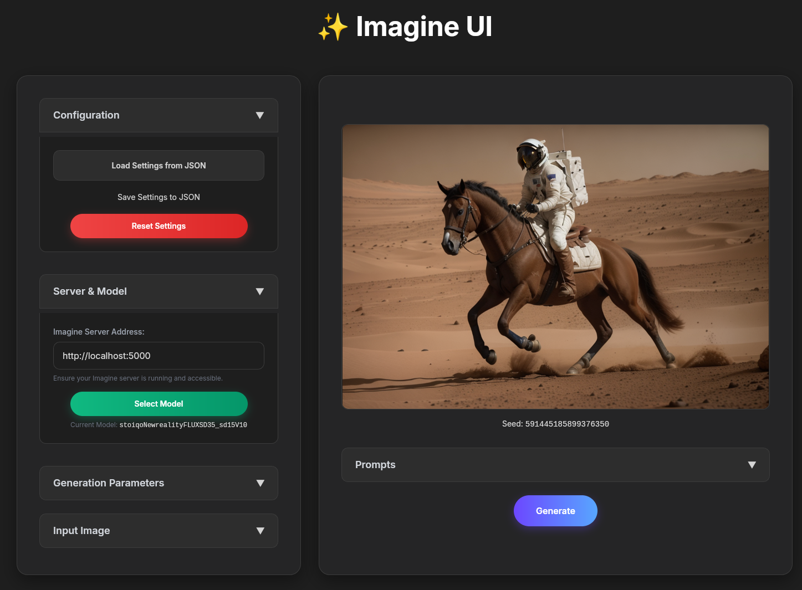

## ✨ Imagine: A Lightweight Stable Diffusion Image Generation API


*Image generated by Imagine: "a photo of an astronaut riding a horse on mars, epic, cinematic, detailed"*

**Imagine** is a simple yet powerful HTTP server designed for generating images from text or other images using Stable Diffusion models and the Hugging Face `diffusers` library. It provides a single, straightforward endpoint that takes a JSON request and returns the generated image(s) as base64-encoded string(s), perfect for quick integration into your applications.

### Key Features

* **Single Executable:** Download and run a single binary – no Python, `pip`, or dependency management required for the end-user.
* **Minimalist API:** One easy-to-use `/generate` endpoint for all your image generation needs.
* **Versatile Generation:** Supports both **Text-to-Image (txt2img)** and **Image-to-Image (img2img)** capabilities.
* **Live Progress Streaming:** Get real-time updates of the generation process by streaming intermediate steps directly to your client.
* **Base64 Output:** Seamlessly receive generated images (both final and intermediate steps) as base64 strings, making them easy to embed directly into web pages, mobile apps, or other services without managing file storage.
* **Comprehensive Parameters:** Control image generation parameters like `model`, `width`, `height`, `steps`, `guidance_scale`, `sampler`, `seed`, `negative_prompt`, **input image (`img`), diffusion strength (`strength`), clip skip (`clip`)** via the JSON payload. Server startup arguments (`--device`, `--full_prec`) control **floating-point precision** and compute device.
* **Offline Mode Support:** Run image generation completely offline once models are downloaded, ideal for local and secure deployments.
* **Built with Diffusers:** Leveraging robust and popular Python libraries for reliability and ease of use.
* **Hardware Agnostic:** Supports CPU, CUDA (NVIDIA), MPS (Apple Silicon), and potentially ROCm (AMD) depending on your PyTorch setup.

### Why Imagine?

**Imagine** is inspired by the philosophy of tools like **Ollama** and offers a similar approach for Stable Diffusion models. It is ideal for developers needing a lightweight solution to run Stable Diffusion image generation **as a local background service**.

This enables integration from **anywhere**: command-line scripts, Python applications, web pages, or other services. With **offline mode support**, you can ensure privacy and consistent performance. You no longer need to worry about the overhead and complexity of more feature-rich diffusion UIs; Imagine provides fast, API-driven access to Stable Diffusion, designed for seamless deployment and easy consumption.

## Imagine Web UI



In addition to the command-line interface, **Imagine** also comes with a simple yet powerful web UI located in `ui/imagine-ui.html`. This UI provides a convenient way to interact with the running Imagine server, allowing you to easily configure all generation parameters and visualize results directly in your browser without using `curl` or writing custom scripts.

It is ideal for quick experimentation, testing parameters, or demonstrating the server's capabilities.

### Key UI Features

* **Intuitive Interface:** All server parameters (`prompt`, `negative prompt`, `width`, `height`, `steps`, `guidance scale`, `clip skip`, `sampler`, `seed`, `strength`, `stream`) are exposed through user-friendly input fields.
* **Image-to-Image Support:** Easily upload an input image for `img2img` operations with live preview.
* **Real-time Progress Visualization:** When `stream` is enabled, observe the image generation progress in real-time as intermediate steps are displayed.
* **Manage Settings:** Load and save your entire generation configuration (including prompts, parameters, and even the last generated image) to/from JSON files, making it easy to share or reuse specific settings. **This includes the ability to load JSON files generated by the `./imagine run` utility for full reproducibility of previous generations and automatic population of all applied parameters.**
* **Real-time Feedback:** Get instant messages about generation status, errors, and cancellations.

### Usage

**Prerequisite:** Ensure your Imagine server is running (see [Run the Imagine Server](#run-the-imagine-server) section).

1.  **Open in Browser:** Navigate to the `ui/` directory in your cloned repository and open the `imagine-ui.html` file in your favorite web browser.
    ```
    file:///path/to/your/imagine/ui/imagine-ui.html
    ```
    (Replace `/path/to/your/imagine` with the actual location of your cloned repository).

2.  **Configure Server Address:** In the "Server & Model" section, verify or set the "Imagine Server Address" (defaults to `http://localhost:5000`).

3.  **Configure Parameters & Generate:** Fill in your desired prompts and adjust other parameters. Click the "Generate" button. *Alternatively, to load previously generated settings, use the "Load Settings from JSON" button in the "Configuration" section and select a JSON file created by the `./imagine run` utility.*

4.  **View Results:** The generated image (or intermediate steps if streaming is enabled) will appear in the main content area. The final seed will also be displayed.

> **Note on CORS:** If you encounter connectivity issues (e.g., "Failed to fetch" errors) when opening `imagine-ui.html` directly as a local file, this might be due to Cross-Origin Resource Sharing (CORS) policies. Ensure your browser allows local file access to external resources, or consider running a simple local web server to serve the `ui/` directory (e.g., `python3 -m http.server 8000` from your `imagine` project root, then navigate to `http://localhost:8000/ui/imagine-ui.html`).

## Setup & Usage

1.  **Download the Imagine Binary:**
    Grab the latest pre-built executable for your operating system from the [Releases page](https://github.com/architector1324/imagine/releases).
    *For Linux/macOS, the executable will likely be named `imagine` or `imagine.x86_64`.*

2.  **Make it Executable (Linux/macOS):**
    ```bash
    chmod +x ./imagine # if the filename is 'imagine'
    # or, for example: chmod +x ./imagine.x86_64
    ```
    You can also move it to a directory in your PATH (e.g., `/usr/local/bin`) for easier access:
    ```bash
    sudo mv ./imagine /usr/local/bin/imagine
    ```
   

3.  **Model Management:**
    Imagine expects your Stable Diffusion model files (`.safetensors`) to be placed in a designated directory.

    * **Default Model Path:** By default, the server will look for models in `~/.imagine/models`.
        You can change this path when running the server using the `--models` argument (e.g., `--models /path/to/your/custom_models`).

4.  **Run the Imagine Server:**
    The server listens for HTTP requests to generate images.

    ```bash
    # Basic start: listens on 0.0.0.0:5000, uses CUDA (float16)
    ./imagine serve

    # Example with specific options:
    # Uses 0.0.0.0:8000, CPU device, full float32 precision, and looks for models in './my_models_folder'
    ./imagine serve --host '0.0.0.0' -p 8000 -d cpu --full_prec --models './my_models_folder'
    ```
    The server will start on the specified address (e.g., `http://0.0.0.0:5000/`).
    * **`--host`**: Server host address. Default: `0.0.0.0`.
    * **`-m, --models`**: SD models path. Default: `~/.imagine/models`.
    * **`-p, --port`**: Server port. Default: `5000`.
    * **`-d, --device DEVICE`**: Model compute device. Choices: `cpu`, `cuda`, `mps`. Default: `imagine_server.DEFAULT_DEVICE`.
    * **`-f, --full_prec`**: Use full (float32) floating point precision instead of float16 (default).

### 5. Generate Images using the CLI Client (`./imagine run`) and Other Commands

The `imagine` binary itself acts as a powerful command-line client to interact with a running Imagine server and perform other utility functions.

**General Usage:**
````

./imagine [COMMAND] [OPTIONS]

````


**Available Commands:**

* **`run [PROMPT...]`**: Generates images using a running Imagine server.
    * **Usage:**
        ```bash
        ./imagine run [OPTIONS] PROMPT [PROMPT...]
        ```
    * **Key Client Options:**
        * `-m, --model MODEL`: The **name** of the SD model to use (e.g., `dreamshaper_8`).
        * `-a, --address ADDRESS`: The address of the running Imagine server (e.g., `127.0.0.1:5000`). Default: `0.0.0.0:5000`.
        * `-o, --output OUTPUT`: Filename to save the image. Default is a timestamp-based filename (e.g., `20231027_153045.png`). If specified, the `.png` file will use this base name.
        * `--meta`: If set, saves a separate JSON metadata file alongside the output image. By default, metadata is embedded directly into the PNG.
        * `-w, --width WIDTH`: Output image width. Default: `512`.
        * `-h, --height HEIGHT`: Output image height. Default: `512`.
        * `-n, --steps NUM_STEPS`: Number of inference steps. Default: `25`.
        * `-g, --guidance GUIDANCE`: Guidance scale. Default: `7.0`.
        * `-d, --strength STRENGTH`: Denoising strength (only if `--img` provided). Default: `0.8`.
        * `-c, --clip CLIP`: Clip skip (integer, usually 1-12). Default: `1`.
        * `--sampler SAMPLER`: SD Sampler (see list below). Default: `'dpm++ 2m'`.
        * `-i, --img IMG`: Input image file path. Default: `None`.
        * `-f, --hires HIRES`: High Resolution fix scale (e.g., `1.5`). Default: `None`.
        * `--seed SEED`: Random seed for reproducibility. Default: A large random integer (e.g., 591445185899376350).
        * `--neg NEG`: Negative prompt. Default: `'ugly, deformed, blurry, low quality'`.
        * `-s, --stream STREAM`: If set to an integer `N > 0`, intermediate images will be streamed every `N` steps, continuously updating the output `.png` file. Default: `None`.

    * **Available Samplers:** `'ddim', 'euler', 'euler a', 'heun', 'lms', 'dpm++ 2m', 'dpm++ 2s', 'dpm++ sde', 'dpm2', 'dpm2 a'`

    * **Example: Basic Text-to-Image (txt2img) via CLI**
        ```bash
        ./imagine run "a photo of an astronaut riding a horse on mars, epic, cinematic, detailed" \
            -m dreamshaper_8 -w 768 -h 512 -n 25 -g 7.0 --sampler 'dpm++ 2m' --neg 'ugly, deformed, blurry, low quality' -c 1
        ```
        This will save a `PNG` image (e.g., `20231027_153045.png`) in the current directory. If `--meta` was used, a `JSON` metadata file with the same base name will also be saved.

    * **Example: Image-to-Image (img2img) via CLI**
        ```bash
        ./imagine run "a futuristic city at sunset, detailed, neon lights" \
            -i my_input_image.png -d 0.7 -w 512 -h 512 -n 30 --sampler 'euler a' --neg "blurry, low quality" -c 1
        ```

    * **Example: Streaming Intermediate Steps via CLI**
        ```bash
        ./imagine run "a cat with a tiny hat, watercolor painting" -s 5
        # This will continuously update the output PNG file with intermediate steps.
        ```

* **`info <IMG_FILE>`**: Get generated image meta information from a JSON file or an image with embedded metadata.
    * **Usage:**
        ```bash
        ./imagine info my_generated_image.png
        ```
        This command will extract and display the metadata (like prompt, model, parameters) associated with the specified image or JSON file.

* **`convert <FILENAME>`**: Convert generated image to JSON meta and vice versa.
    * **Usage:**
        ```bash
        ./imagine convert my_image.png # Converts image to JSON meta and saves as my_image.json
        ./imagine convert my_meta.json # Converts JSON meta (with base64 image) to a .png file
        ```
        This is useful for programmatic access or managing your generated images and their settings.

* **`enhance [PROMPT...]`**: Prompt enhancer with LLM (Large Language Model).
    * **Usage:**
        ```bash
        ./imagine enhance [OPTIONS] PROMPT [PROMPT...]
        ```
    * **Options:**
        * `-m, --model MODEL`: LLM model to use (e.g., `gemma:2b`). Default: `imagine_enhance.DEFAULT_MODEL`.
        * `-s, --stream`: Stream output as it's generated. Default: `false`.
        * `-n, --neg`: Include a negative prompt in the enhanced output. Default: `false`.
    * **Example:**
        ```bash
        ./imagine enhance "a cat with a tiny hat" -s -n
        ```
        This will send your simplified prompt to an LLM to generate a more detailed and potentially negative prompt, streaming the output.

* **`list`**: List available Stable Diffusion models.
    * **Usage:**
        ```bash
        ./imagine list
        ```
        This will output a list of model names found in the configured models directory (e.g., `dreamshaper_8`).

6.  **Interact with the API (POST request to `/generate`):**
    The `/generate` endpoint expects a JSON payload with your generation parameters. The response will be a JSON object containing the `img` (base64-encoded PNG) and the `seed`. If `stream` is enabled, it will return a stream of JSON objects (one JSON object per line).

    **Available parameters in the JSON payload:**
    * `prompt` (string, **required**): The text prompt for image generation.
    * `model` (string, **required**): The **name** of the Stable Diffusion model to use (e.g., `dreamshaper_8`). This name should correspond to a `.safetensors` (without the extension) in the server's configured models directory.
    * `width` (int, optional): Output image width in pixels. Default: `512`.
    * `height` (int, optional): Output image height in pixels. Default: `512`.
    * `steps` (int, optional): Number of inference steps. Default: `25`.
    * `guidance` (float, optional): Classifier-free guidance scale. Default: `7.0`.
    * `sampler` (string, optional): Sampler algorithm. Available: `'ddim', 'euler', 'euler a', 'heun', 'lms', 'dpm++ 2m', 'dpm++ 2s', 'dpm++ sde', 'dpm2', 'dpm2 a'`. Default: `'dpm++ 2m'`.
    * `seed` (string, optional): Random seed for reproducibility. Default: a random integer represented as string.
    * `neg` (string, optional): Negative prompt. Default: `''` (empty string).
    * `img` (string, optional): Base64-encoded input image (raw base64 string). If provided, enables `img2img` mode. Default: `None`.
    * `strength` (float, optional): Denoising strength for `img2img` mode (0.0 to 1.0). Controls how much the image is changed. Default: `0.8`.
    * `clip` (int, optional): Clip skip. Specifies how many layers to skip in the CLIP text encoder. Higher values (e.g., 2-12) can lead to more "raw" or less "over-stylized" output, depending on the model. Default: `1`.
    * `stream` (int, optional): If set to an integer `N > 0`, intermediate images will be streamed every `N` steps as separate JSON objects. If `null` or `0`, only the final image is returned. Default: `None`.

    ---

    **Example: Basic Text-to-Image (txt2img)**
    ```bash
    curl -X POST -H "Content-Type: application/json" \
        -d '{ # Make sure the server has 'dreamshaper_8.safetensors' in its models directory
            "model": "dreamshaper_8",
            "prompt": "a photo of an astronaut riding a horse on mars, epic, cinematic, detailed",
            "width": 768,
            "height": 512,
            "steps": 25,
            "guidance": 7.0,
            "sampler": "dpm++ 2m",
            "seed": 591445185899376350,
            "neg": "ugly, deformed, blurry, low quality",
            "clip": 1
        }' \
        http://localhost:5000/generate | jq .
    ```
    The response will be a JSON object containing the `img` string and the `seed`.

    ---

    **Example: Image-to-Image (img2img)**
    (Replace `<base64_encoded_image>` with your actual base64 encoded image data).
    ```bash
    echo '{
        "prompt": "a futuristic city at sunset, detailed, neon lights",
        "img": "<base64_encoded_image>",
        "strength": 0.7,
        "width": 512,
        "height": 512,
        "sampler": "euler a",
        "steps": 30,
        "neg": "blurry, low quality",
        "clip": 1
    }' | curl -X POST -H "Content-Type: application/json" -d @- http://localhost:5000/generate | jq .
    ```

    ---

    **Example: Streaming Intermediate Steps**
    This will stream multiple JSON objects. Each object, except the last one, will contain an `img` (intermediate step). The final object will contain the `img` of the completed generation.
    ```bash
    curl -X POST -H "Content-Type: application/json" \
        -d '{
            "prompt": "a cat with a tiny hat, watercolor painting",
            "width": 512,
            "height": 512,
            "steps": 25,
            "stream": 5,
            "clip": 1
        }' \
        http://localhost:5000/generate
    # This will output multiple JSON lines.
    # To process this, you might use tools like `jq -nc --stream 'fromjson'` or handle it in your code.
    ```

### Output Format and Reproducibility

The `./imagine run` command (CLI client) by default generates a PNG file with all generation metadata embedded within it. This means the image file itself is self-contained and includes all parameters (prompt, model, dimensions, steps, etc.) that were used to create it. This provides full traceability of how the image was created directly from the image file.

If you use the `--meta` flag, a separate JSON file will also be generated. This JSON file will contain the parameters used for generation (`meta` field) and the generated image itself in base64 format (`out` field).

**JSON Output Structure (when `--meta` is used):**

```json
{
    "meta": {
        "model": "dreamshaper_8", # The name of the model used
        "prompt": "a photo of an astronaut riding a horse on mars, epic, cinematic, detailed",
        "width": 768,
        "height": 512,
        "steps": 25,
        "guidance": 7.0,
        "sampler": "dpm++ 2m",
        "seed": "591445185899376350",
        "neg": "ugly, deformed, blurry, low quality",
        "clip": 1,
        "stream": 1,
        "img": null,
        "strength": 0.8
    },
    "out": "<base64 encoded image string>"
}
````

  * `meta`: Contains all the parameters (prompt, model, dimensions, steps, etc.) that were sent to the Imagine server for this specific generation. This provides full traceability of how the image was created.
  * `out`: The base64 string of the generated image.

**Reproducibility with the Web UI:**

**Key Point:** The embedded metadata in the PNG, or the separately generated JSON file (e.g., `20231027_153045.json` if saved by timestamp), can be directly loaded into the [Imagine Web UI](#imagine-web-ui) using the "Load Settings from JSON" button. This allows you to instantly restore all parameters used for a specific generation and view the result, making the process of reproducing, adjusting, and sharing your creations incredibly simple. **Note: The `model` field in the JSON will contain the model's name, not its full path.**

## Advanced Deployment: Running as a Systemd Service

For persistent and reliable operation, you can set up **Imagine** as a `systemd` service. This ensures the server starts automatically on boot and restarts in case of crashes.

**1. Place the Imagine Binary:**

First, ensure your downloaded `imagine` binary is placed in a directory that is part of your system's `PATH` (e.g., `/usr/local/bin/`). If it's not already named `imagine`, consider renaming it for simplicity.

```bash
# Assuming your downloaded binary is named 'imagine' (or you've renamed it)
sudo mv ./imagine /usr/local/bin/imagine

# Make it executable (if not already)
sudo chmod +x /usr/local/bin/imagine
```

**2. Create the Systemd Service File:**

Create a file named `imagine.service` in `/etc/systemd/system/`:

```bash
sudo nano /etc/systemd/system/imagine.service
```

Paste the following content into the file:

```ini
[Unit]
Description=Imagine: Stable Diffusion Image Generation Server
After=network.target syslog.target

[Service]
# REPLACE 'your_username' WITH YOUR LINUX USERNAME!
# Run the service as your current user.
# This simplifies permissions as the models are likely in your user's home directory.
User=your_username

# The command to execute when the service starts.
# This directly calls the 'imagine' binary with the 'serve' subcommand and desired arguments.
# Make sure the path to the 'imagine' binary is correct (e.g., /usr/local/bin/imagine).
ExecStart=/usr/local/bin/imagine serve -d cuda --full_prec --models /home/your_username/.imagine/models

# Restart the service if it crashes
Restart=on-failure
RestartSec=5s

# Standard output and error will be directed to the systemd journal for easy debugging
StandardOutput=journal
StandardError=journal

# Type of service: simple (default) or forking
Type=simple

[Install]
# This unit should be started when the system reaches multi-user.target (normal boot)
WantedBy=multi-user.target
```

**Important Notes:**

  * **Replace `your_username` with your actual Linux username\!**
  * The `ExecStart` line must use the **full path** to your `imagine` binary (e.g., `/usr/local/bin/imagine`) followed by the `serve` subcommand and any desired server arguments (e.g., `-d cuda --full_prec --models /path/to/your/models`).
  * Ensure the `--models` path is **absolute** and accessible by the `User` specified in the service file.

**3. Enable and Start the Service:**

After saving the `imagine.service` file:

```bash
# Reload systemd to recognize the new service
sudo systemctl daemon-reload

# Enable the service to start on boot
sudo systemctl enable imagine.service

# Start the service immediately
sudo systemctl start imagine.service
```

**4. Check Service Status and Logs:**

To verify that the service is running correctly:

```bash
sudo systemctl status imagine.service
```

To view real-time logs for debugging:

```bash
journalctl -u imagine.service -f
```