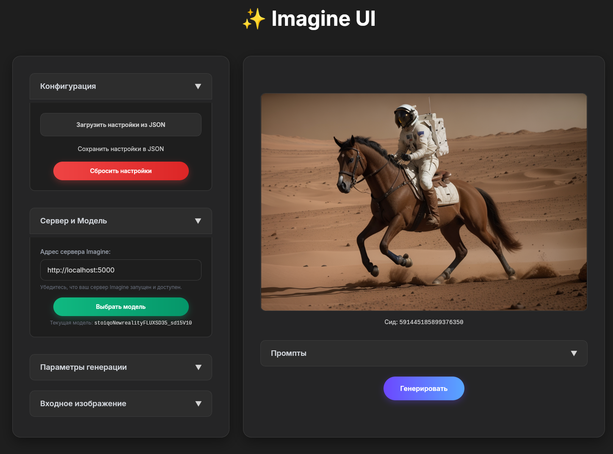

## ✨ Imagine: Легковесный API для генерации изображений с Stable Diffusion


*Изображение сгенерировано с помощью Imagine: "a photo of an astronaut riding a horse on mars, epic, cinematic, detailed"*

**Imagine** - это простой, но мощный HTTP-сервер, разработанный для генерации изображений из текста **или других изображений** с использованием моделей Stable Diffusion и библиотеки `diffusers` от Hugging Face. Он предоставляет одну, понятную конечную точку, которая принимает JSON-запрос и возвращает сгенерированное изображение (или изображения) в виде Base64-кодированной строки (строк), что идеально подходит для быстрой интеграции в ваши приложения.

### Ключевые особенности

*   **Единый исполняемый файл:** Загрузите и запустите один бинарный файл – нет необходимости в Python, `pip` или управлении зависимостями для конечного пользователя.
*   **Минималистичный API:** Одна простая в использовании конечная точка `/generate` для всех ваших потребностей в генерации изображений.
*   **Универсальная генерация:** Поддерживает как **преобразование текста в изображение (txt2img)**, так и **преобразование изображения в изображение (img2img)**.
*   **Потоковая передача прогресса в реальном времени:** Получайте обновления процесса генерации в реальном времени, передавая промежуточные шаги непосредственно клиенту.
*   **Вывод в Base64:** Удобно получайте сгенерированные изображения (как финальные, так и промежуточные шаги) в виде строк Base64, что позволяет легко встраивать их непосредственно в веб-страницы, мобильные приложения или другие сервисы, не управляя файловым хранилищем.
*   **Расширенные параметры:** Контролируйте параметры генерации изображений, такие как `model` (обязательное имя файла модели), `width`, `height`, `num_steps`, `guidance_scale`, `sampler`, `seed`, `negative_prompt`, **входное изображение (`img`), сила диффузии (`strength`)** через JSON-полезную нагрузку. Аргументы при запуске сервера (`--device`, `--full_prec`) контролируют **точность с плавающей запятой** и вычислительное устройство.
*   **Поддержка автономного режима:** Запускайте генерацию изображений полностью в автономном режиме после загрузки моделей, что идеально подходит для локальных и безопасных развертываний.
*   **Создан на Diffusers:** Использует надежную и популярную библиотеку Python для обеспечения надежности и простоты использования.
*   **Независимость от аппаратного обеспечения:** Поддерживает CPU, CUDA (NVIDIA), MPS (Apple Silicon) и потенциально ROCm (AMD) в зависимости от вашей настройки PyTorch.

### Почему Imagine?

**Imagine** вдохновлен философией таких инструментов, как **Ollama**, и предлагает аналогичный подход для моделей Stable Diffusion. Он идеально подходит для разработчиков, которым требуется легковесное решение для запуска генерации изображений Stable Diffusion **как локального сервиса в фоновом режиме**.

Это позволяет вам интегрировать возможности генерации изображений **из любого места**: будь то скрипт командной строки, Python-приложение, веб-страница или любой другой сервис. **Благодаря поддержке автономного режима** вы можете обеспечить конфиденциальность и стабильную производительность. Вам больше не нужно беспокоиться о накладных расходах и сложности многофункциональных пользовательских интерфейсов; Imagine обеспечивает быстрый, API-ориентированный доступ к Stable Diffusion, разработанный для беспрепятственного развертывания и простого использования.

## Imagine Web UI



Помимо интерфейса командной строки, **Imagine** также поставляется с простым, но мощным веб-интерфейсом, расположенным в `ui/imagine-ui.ru.html`. Этот UI предоставляет удобный способ взаимодействия с запущенным сервером Imagine, позволяя легко настраивать все параметры генерации и визуализировать результаты непосредственно в браузере без использования `curl` или написания пользовательских скриптов.

Он идеально подходит для экспериментов, тестирования параметров или демонстрации возможностей сервера.

### Ключевые возможности UI

*   **Интуитивно понятный интерфейс:** Все параметры сервера (`prompt`, `negative prompt`, `width`, `height`, `num_steps`, `guidance scale`, `sampler`, `seed`, `strength`, `stream`) представлены через удобные поля ввода.
*   **Поддержка Image-to-Image:** Легко загружайте входное изображение для операций `img2img` с живым предпросмотром.
*   **Визуализация прогресса в реальном времени:** Когда `stream` включен, наблюдайте за прогрессом генерации изображения в реальном времени, так как отображаются промежуточные шаги.
*   **Управление настройками:** Загружайте и сохраняйте всю вашу конфигурацию генерации (включая промпты, параметры и даже последнее сгенерированное изображение) в/из JSON-файлов, что упрощает совместное использование или повторное использование конкретных настроек. **Это включает возможность загружать JSON-файлы, сгенерированные утилитой `./imagine run` для полной воспроизводимости предыдущих генераций и автоматической подстановки всех примененных параметров.**
*   **Обратная связь в реальном времени:** Получайте мгновенные сообщения о статусе генерации, ошибках и отменах.

### Использование

**Предварительное условие:** Убедитесь, что ваш Imagine сервер запущен (см. раздел [Запустите Imagine сервер](#запустите-imagine-сервер)).

1.  **Откройте в браузере:** Перейдите в директорию `ui/` вашего клонированного репозитория и откройте файл `imagine-ui.ru.html` в вашем любимом веб-браузере.
    ```
    file:///path/to/your/imagine/ui/imagine-ui.ru.html
    ```
    (Замените `/path/to/your/imagine` на фактическое расположение вашего клонированного репозитория).

2.  **Настройте адрес сервера:** В секции "Сервер и модель" проверьте или установите "Адрес сервера Imagine" (по умолчанию `http://localhost:5000`).

3.  **Настройте параметры и сгенерируйте:** Заполните желаемые промпты и настройте другие параметры. Нажмите кнопку "Генерировать". *Или, чтобы загрузить ранее сгенерированные настройки, используйте кнопку "Загрузить настройки из JSON" в секции "Конфигурация" и выберите JSON-файл, созданный утилитой `./imagine run`.*

4.  **Просмотр результатов:** Сгенерированное изображение (или промежуточные шаги, если включен стриминг) появится в основной области содержимого. Также будет отображен итоговый сид.

> **Примечание о CORS:** Если вы столкнетесь с проблемами подключения (например, ошибками "Failed to fetch") при открытии `imagine-ui.ru.html` непосредственно как локального файла, это может быть связано с политиками Cross-Origin Resource Sharing (CORS). Убедитесь, что ваш браузер разрешает локальный доступ к файлам для внешних ресурсов, или рассмотрите возможность запуска простого локального веб-сервера для обслуживания директории `ui/` (например, `python3 -m http.server 8000` из корневой директории проекта `imagine`, затем перейдите по адресу `http://localhost:8000/ui/imagine-ui.ru.html`).

## Установка и использование

1.  **Загрузите исполняемый файл Imagine:**
    Загрузите последнюю предварительно скомпилированную версию для вашей операционной системы со [страницы релизов](https://github.com/architector1324/imagine/releases).
    *Для Linux/macOS исполняемый файл, скорее всего, будет называться `imagine` или `imagine.x86_64`.*

2.  **Сделайте его исполняемым (Linux/macOS):**
    ```bash
    chmod +x ./imagine # если имя файла 'imagine'
    # или, например: chmod +x ./imagine.x86_64
    ```
    Вы также можете переместить его в директорию, которая находится в вашем PATH (например, `/usr/local/bin`), для более удобного доступа:
    ```bash
    sudo mv ./imagine /usr/local/bin/imagine
    ```

3.  **Управление моделями:**
    Imagine ожидает, что ваши файлы моделей Stable Diffusion (`.safetensors`) будут расположены в специально выделенной директории.

    *   **Путь к модели по умолчанию:** По умолчанию сервер будет искать модели в `~/.imagine/models`.
        Вы можете изменить этот путь при запуске сервера, используя аргумент `--models` (например, `--models /path/to/your/custom_models`).
    *   **Перечисление доступных моделей:**
        Чтобы увидеть, какие модели доступны серверу, используйте команду `list`:
        ```bash
        ./imagine list
        ```
        Это выведет список имен моделей, найденных в настроенной директории моделей (например, `dreamshaper_8`).
    *   **Загрузка моделей:** Вы можете загрузить модели Stable Diffusion из таких источников, как Civitai или Hugging Face, и поместить их в вашу директорию моделей (например, `~/.imagine/models/dreamshaper_8.safetensors`).

4.  **Запустите Imagine сервер:**
    Сервер ожидает HTTP-запросы для генерации изображений.

    ```bash
    # Базовый запуск: слушает на 0.0.0.0:5000, использует CUDA (float16)
    ./imagine serve

    # Пример с конкретными опциями:
    # Использует 0.0.0.0:8000, устройство CPU, полную точность float32, и ищет модели в './my_models_folder'
    ./imagine serve --host '0.0.0.0' -p 8000 -d cpu --full_prec --models './my_models_folder'
    ```
    Сервер запустится по указанному адресу (например, `http://0.0.0.0:5000/`).

5.  **Генерация изображений с помощью CLI-клиента (`./imagine run`):**
    Сам бинарник `imagine` действует как мощный клиент командной строки для взаимодействия с запущенным Imagine сервером.

    **Использование:**
    ```
    ./imagine run [OPTIONS] PROMPT [PROMPT...]
    ```

    **Основные параметры клиента:**
    *   `-m, --model MODEL`: **Имя** SD-модели для использования (например, `dreamshaper_8`).
    *   `-a, --address ADDRESS`: Адрес запущенного Imagine сервера (например, `127.0.0.1:5000`). По умолчанию: `0.0.0.0:5000`.
    *   `-o, --output OUTPUT`: Имя файла для сохранения изображения и сопутствующего JSON (по умолчанию - на основе временной метки).
    *   `-w, --width WIDTH`: Ширина выходного изображения.
    *   `-h, --height HEIGHT`: Высота выходного изображения.
    *   `-n, --num_steps NUM_STEPS`: Количество шагов инференса.
    *   `-g, --guidance GUIDANCE`: Масштаб CFG (guidance scale).
    *   `-d, --strength STRENGTH`: Сила денойзинга (только если предоставлен `--img`).
    *   `--sampler SAMPLER`: SD Sampler (см. список ниже).
    *   `-i, --img IMG`: Путь к файлу входного изображения.
    *   `-f, --hires HIRES`: Масштаб исправления высокого разрешения (например, `1.5`).
    *   `--seed SEED`: Случайное начальное число для воспроизводимости.
    *   `--neg NEG`: Негативный промпт.
    *   `-s, --stream STREAM`: Если установлено целое число `N > 0`, промежуточные изображения будут передаваться потоком каждые `N` шагов, постоянно обновляя выходной `.png` файл.

    **Доступные Sampler'ы:** `'ddim', 'euler', 'euler a', 'heun', 'lms', 'dpm++ 2m', 'dpm++ 2s', 'dpm++ sde', 'dpm2', 'dpm2 a'`

    **Пример: Базовое преобразование текста в изображение (txt2img) через CLI**
    ```bash
    ./imagine run "a photo of an astronaut riding a horse on mars, epic, cinematic, detailed" \
        -m dreamshaper_8 -w 768 -h 512 -n 25 -g 7.0 --sampler 'dpm++ 2m' --neg 'уродливый, деформированный, размытый, низкое качество'
    ```
    Это сохранит изображение в формате `PNG` и файл метаданных `JSON` в текущей директории.

    **Пример: Преобразование изображения в изображение (img2img) через CLI**
    ```bash
    ./imagine run "футуристический город на закате, детализированный, неоновые огни" \
        -i my_input_image.png -d 0.7 -w 512 -h 512 -n 30 --sampler 'euler a' --neg "размытый, низкое качество"
    ```

    **Пример: Потоковая передача промежуточных шагов через CLI**
    ```bash
    ./imagine run "кошка в крошечной шляпке, акварельная живопись" -s 5
    # Это будет постоянно обновлять выходной PNG-файл промежуточными шагами.
    ```

6.  **Взаимодействие с API (POST-запрос к `/generate`):**
    Конечная точка `/generate` ожидает JSON-полезную нагрузку с вашими параметрами генерации. Ответ будет JSON-объектом, содержащим `img` (Base64-кодированный PNG) и `seed`. Если `stream` включен, он будет возвращать поток JSON-объектов (один JSON-объект на строку).

    **Доступные параметры в JSON-полезной нагрузке:**
    *   `prompt` (строка, **обязательно**): Текстовый запрос для генерации изображения.
    *   `model` (строка, **обязательно**): **Имя** Stable Diffusion модели для использования (например, `dreamshaper_8`). Это имя должно соответствовать файлу `.safetensors` (без расширения) в настроенной директории моделей сервера.
    *   `width` (целое число, необязательно): Ширина выходного изображения в пикселях. По умолчанию: `512`.
    *   `height` (целое число, необязательно): Высота выходного изображения в пикселях. По умолчанию: `512`.
    *   `num_steps` (целое число, необязательно): Количество шагов инференса. По умолчанию: `25`.
    *   `guidance` (число с плавающей запятой, необязательно): Масштаб CFG (classifier-free guidance). По умолчанию: `7.0`.
    *   `sampler` (строка, необязательно): Алгоритм сэмплера. Доступно: `'ddim', 'euler', 'euler a', 'heun', 'lms', 'dpm++ 2m', 'dpm++ 2s', 'dpm++ sde', 'dpm2', 'dpm2 a'`. По умолчанию: `'dpm++ 2m'`.
    *   `seed` (строка, необязательно): Случайное начальное число для воспроизводимости. По умолчанию: случайное целое число, представленное в виде строки.
    *   `neg` (строка, необязательно): Негативный промпт. По умолчанию: `''` (пустая строка).
    *   `img` (строка, необязательно): Base64-кодированное входное изображение (сырая строка base64). Если предоставлено, активирует режим `img2img`. По умолчанию: `None`.
    *   `strength` (число с плавающей запятой, необязательно): Сила денойзинга для режима `img2img` (от 0.0 до 1.0). Контролирует, насколько сильно изменяется изображение. По умолчанию: `0.8`.
    *   `stream` (целое число, необязательно): Если установлено целое число `N > 0`, промежуточные изображения будут передаваться потоком каждые `N` шагов в виде отдельных JSON-объектов. Если `null` или `0`, возвращается только финальное изображение. По умолчанию: `None`.

    ---

    **Пример: Базовое преобразование текста в изображение (txt2img)**
    ```bash
    curl -X POST -H "Content-Type: application/json" \
        -d '{ # Убедитесь, что сервер имеет 'dreamshaper_8.safetensors' в своей директории моделей
            "model": "dreamshaper_8",
            "prompt": "фотография астронавта, скачущего на лошади по Марсу, эпично, кинематографично, детализированно",
            "width": 768,
            "height": 512,
            "num_steps": 25,
            "guidance": 7.0,
            "sampler": "dpm++ 2m",
            "seed": 591445185899376350,
            "neg": "уродливый, деформированный, размытый, низкое качество"
        }' \
        http://localhost:5000/generate | jq .
    ```
    В ответ вы получите JSON-объект, содержащий строку `img` и `seed`.

    ---

    **Пример: Преобразование изображения в изображение (img2img)**
    (Замените `<base64_encoded_image>` на ваши фактические данные изображения, закодированные в base64).
    ```bash
    echo '{
        "prompt": "футуристический город на закате, детализированный, неоновые огни",
        "img": "<base64_encoded_image>",
        "strength": 0.7,
        "width": 512,
        "height": 512,
        "sampler": "euler a",
        "num_steps": 30,
        "neg": "размытый, низкое качество"
    }' | curl -X POST -H "Content-Type: application/json" -d @- http://localhost:5000/generate | jq .
    ```

    ---

    **Пример: Потоковая передача промежуточных шагов**
    Это будет передавать несколько JSON-объектов. Каждый объект, кроме последнего, будет содержать `img` (промежуточный шаг). Последний объект будет содержать `img` завершенной генерации.
    ```bash
    curl -X POST -H "Content-Type: application/json" \
         -d '{
             "prompt": "кошка в крошечной шляпке, акварельная живопись",
             "width": 512,
             "height": 512,
             "num_steps": 25,
             "stream": 5
         }' \
         http://localhost:5000/generate
    # Для обработки этого вы можете использовать инструменты вроде `jq -nc --stream 'fromjson'` или обрабатывать в вашем коде.
    ```

### Формат вывода и воспроизводимость

Команда `./imagine run` (CLI-клиент) по умолчанию генерирует JSON-файл вместе со сгенерированным изображением. Этот JSON-файл содержит все параметры, использованные для генерации (поле `meta`), и само сгенерированное изображение в формате base64 (поле `out`).

Такой стандартизированный вывод обеспечивает полную воспроизводимость и бесшовную интеграцию.

**Структура JSON-вывода:**

```json
{
    "meta": {
        "model": "dreamshaper_8", # Имя используемой модели
        "prompt": "a photo of an astronaut riding a horse on mars, epic, cinematic, detailed",
        "width": 768,
        "height": 512,
        "num_steps": 25,
        "guidance": 7.0,
        "sampler": "dpm++ 2m",
        "seed": "591445185899376350",
        "neg": "уродливый, деформированный, размытый, низкое качество",
        "stream": 1,
        "img": null,
        "strength": 0.8
    },
    "out": "<base64 encoded image string>"
}
```

*   `meta`: Содержит все параметры (промпт, модель, размеры, шаги и т.д.), которые были отправлены на сервер Imagine для этой конкретной генерации. Это обеспечивает полную отслеживаемость того, как было создано изображение.
*   `out`: Строка сгенерированного изображения в формате base64.

**Воспроизводимость с веб-интерфейсом:**

**Ключевой момент:** этот сгенерированный JSON-файл (например, `20231027_153045.json`, если сохранено по временной метке) может быть непосредственно загружен в [веб-интерфейс Imagine UI](#imagine-web-ui) с помощью кнопки "Загрузить настройки из JSON". Это позволяет мгновенно восстановить все параметры, использованные для конкретной генерации, и просмотреть результат, что делает процесс воспроизведения, корректировки и обмена вашими творениями невероятно простым. **Примечание: Поле `model` в JSON будет содержать имя модели, а не ее полный путь.**

### Выходные файлы

По умолчанию клиент сохранит два файла в текущую директорию:
*   Файл изображения `.png` с именем, основанным на промпте или временной метке (например, `my_prompt_12345.png` или `20231027_153045.png`).
*   Файл `.json` с тем же базовым именем, содержащий полные метаданные генерации и base64-изображение (например, `my_prompt_12345.json` или `20231027_153045.json`).

Вы можете управлять именем выходного файла изображения с помощью флага `-o` или `--output`. Если имя файла указано, то и `.png`, и `.json` будут использовать это базовое имя.

## Расширенное развертывание: Запуск как служба Systemd

Для постоянной и надежной работы вы можете настроить **Imagine** как службу `systemd`. Это гарантирует, что сервер будет автоматически запускаться при загрузке и перезапускаться в случае сбоев.

**1. Разместите исполняемый файл Imagine:**

Сначала убедитесь, что ваш загруженный исполняемый файл `imagine` находится в директории, которая является частью системного `PATH` (например, `/usr/local/bin/`). Если он еще не назван `imagine`, рассмотрите возможность переименования для простоты.

```bash
# Предполагая, что ваш загруженный бинарник называется 'imagine' (или вы его переименовали)
sudo mv ./imagine /usr/local/bin/imagine

# Сделайте его исполняемым (если еще не сделано)
sudo chmod +x /usr/local/bin/imagine
```

**2. Создайте файл службы Systemd:**

Создайте файл с именем `imagine.service` в `/etc/systemd/system/`:

```bash
sudo nano /etc/systemd/system/imagine.service
```

Вставьте следующее содержимое в файл:

```ini
[Unit]
Description=Imagine: Сервер генерации изображений Stable Diffusion
After=network.target syslog.target

[Service]
# ЗАМЕНИТЕ 'your_username' НА ВАШЕ ИМЯ ПОЛЬЗОВАТЕЛЯ LINUX!
# Запускайте сервис от имени вашего текущего пользователя.
# Это упрощает управление разрешениями, так как модели, скорее всего, находятся в вашей домашней директории.
User=your_username

# Команда для выполнения при запуске сервиса.
# Это напрямую вызывает бинарник 'imagine' с подкомандой 'serve' и желаемыми аргументами.
# Убедитесь, что путь к бинарнику 'imagine' указан верно (например, /usr/local/bin/imagine).
ExecStart=/usr/local/bin/imagine serve -d cuda --full_prec --models /home/your_username/.imagine/models

# Перезапускать сервис, если он аварийно завершится
Restart=on-failure
RestartSec=5s

# Стандартный вывод и ошибки будут направлены в журнал systemd для удобной отладки
StandardOutput=journal
StandardError=journal

# Тип сервиса: simple (по умолчанию) или forking
Type=simple

[Install]
# Этот юнит должен запускаться, когда система достигает состояния multi-user.target (нормальная загрузка)
WantedBy=multi-user.target
```

**Важные примечания:**
*   **Замените `your_username` на ваше фактическое имя пользователя Linux!**
*   Строка `ExecStart` должна использовать **полный путь** к вашему бинарнику `imagine` (например, `/usr/local/bin/imagine`), за которым следует подкоманда `serve` и любые желаемые аргументы сервера (например, `-d cuda --full_prec --models /path/to/your/models`).
*   Убедитесь, что путь `--models` является **абсолютным** и доступен пользователю, указанному в файле службы (`User`).

**3. Включите и запустите службу:**

После сохранения файла `imagine.service`:

```bash
# Перезагрузите systemd, чтобы он распознал новый сервис
sudo systemctl daemon-reload

# Включите сервис для автоматического запуска при загрузке
sudo systemctl enable imagine.service

# Запустите сервис немедленно
sudo systemctl start imagine.service
```

**4. Проверьте статус службы и логи:**

Чтобы проверить, что служба работает корректно:

```bash
sudo systemctl status imagine.service
```

Чтобы просмотреть логи в реальном времени для отладки:

```bash
journalctl -u imagine.service -f
```